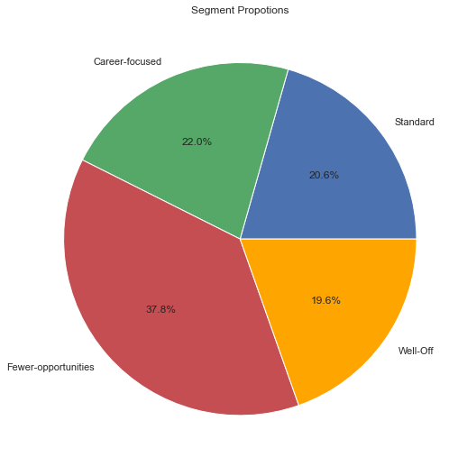
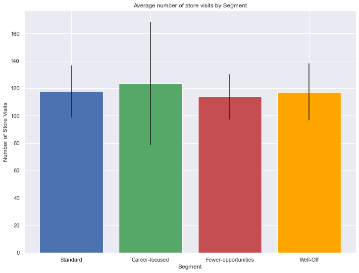
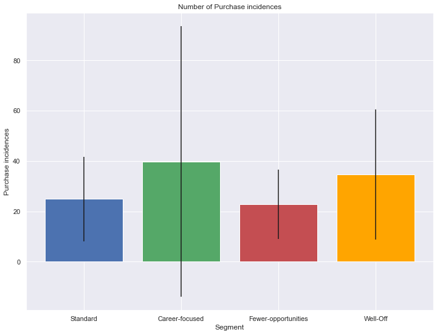
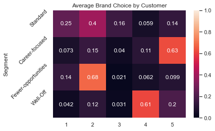
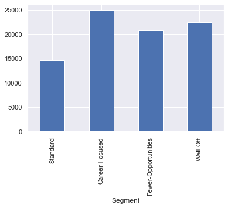

# Customer Analytics - Targeting, Descriptive Analytics (Part 2)


```python
import pandas as pd, numpy as np, matplotlib.pyplot as plt, seaborn as sns

from sklearn.preprocessing import StandardScaler
from sklearn.cluster import KMeans
from sklearn.decomposition import PCA

import pickle
```


```python
sns.set()
```


```python
df = pd.read_csv('/Users/mhlaghari/Downloads/purchase data.csv')
```


```python
df.head()
```


<div>

<table border="1" class="dataframe">
  <thead>
    <tr style="text-align: right;">
      <th></th>
      <th>ID</th>
      <th>Day</th>
      <th>Incidence</th>
      <th>Brand</th>
      <th>Quantity</th>
      <th>Last_Inc_Brand</th>
      <th>Last_Inc_Quantity</th>
      <th>Price_1</th>
      <th>Price_2</th>
      <th>Price_3</th>
      <th>...</th>
      <th>Promotion_3</th>
      <th>Promotion_4</th>
      <th>Promotion_5</th>
      <th>Sex</th>
      <th>Marital status</th>
      <th>Age</th>
      <th>Education</th>
      <th>Income</th>
      <th>Occupation</th>
      <th>Settlement size</th>
    </tr>
  </thead>
  <tbody>
    <tr>
      <th>0</th>
      <td>200000001</td>
      <td>1</td>
      <td>0</td>
      <td>0</td>
      <td>0</td>
      <td>0</td>
      <td>0</td>
      <td>1.59</td>
      <td>1.87</td>
      <td>2.01</td>
      <td>...</td>
      <td>0</td>
      <td>0</td>
      <td>0</td>
      <td>0</td>
      <td>0</td>
      <td>47</td>
      <td>1</td>
      <td>110866</td>
      <td>1</td>
      <td>0</td>
    </tr>
    <tr>
      <th>1</th>
      <td>200000001</td>
      <td>11</td>
      <td>0</td>
      <td>0</td>
      <td>0</td>
      <td>0</td>
      <td>0</td>
      <td>1.51</td>
      <td>1.89</td>
      <td>1.99</td>
      <td>...</td>
      <td>0</td>
      <td>0</td>
      <td>0</td>
      <td>0</td>
      <td>0</td>
      <td>47</td>
      <td>1</td>
      <td>110866</td>
      <td>1</td>
      <td>0</td>
    </tr>
    <tr>
      <th>2</th>
      <td>200000001</td>
      <td>12</td>
      <td>0</td>
      <td>0</td>
      <td>0</td>
      <td>0</td>
      <td>0</td>
      <td>1.51</td>
      <td>1.89</td>
      <td>1.99</td>
      <td>...</td>
      <td>0</td>
      <td>0</td>
      <td>0</td>
      <td>0</td>
      <td>0</td>
      <td>47</td>
      <td>1</td>
      <td>110866</td>
      <td>1</td>
      <td>0</td>
    </tr>
    <tr>
      <th>3</th>
      <td>200000001</td>
      <td>16</td>
      <td>0</td>
      <td>0</td>
      <td>0</td>
      <td>0</td>
      <td>0</td>
      <td>1.52</td>
      <td>1.89</td>
      <td>1.98</td>
      <td>...</td>
      <td>0</td>
      <td>0</td>
      <td>0</td>
      <td>0</td>
      <td>0</td>
      <td>47</td>
      <td>1</td>
      <td>110866</td>
      <td>1</td>
      <td>0</td>
    </tr>
    <tr>
      <th>4</th>
      <td>200000001</td>
      <td>18</td>
      <td>0</td>
      <td>0</td>
      <td>0</td>
      <td>0</td>
      <td>0</td>
      <td>1.52</td>
      <td>1.89</td>
      <td>1.99</td>
      <td>...</td>
      <td>0</td>
      <td>0</td>
      <td>0</td>
      <td>0</td>
      <td>0</td>
      <td>47</td>
      <td>1</td>
      <td>110866</td>
      <td>1</td>
      <td>0</td>
    </tr>
  </tbody>
</table>
<p>5 rows × 24 columns</p>
</div>


```python
scaler = pickle.load(open('scaler.pickle','rb'))
pca = pickle.load(open('pca.pickle','rb'))
kmeans_pca = pickle.load(open('kmeans_pca.pickle','rb'))
```


```python
df.columns
```


    Index(['ID', 'Day', 'Incidence', 'Brand', 'Quantity', 'Last_Inc_Brand',
           'Last_Inc_Quantity', 'Price_1', 'Price_2', 'Price_3', 'Price_4',
           'Price_5', 'Promotion_1', 'Promotion_2', 'Promotion_3', 'Promotion_4',
           'Promotion_5', 'Sex', 'Marital status', 'Age', 'Education', 'Income',
           'Occupation', 'Settlement size'],
          dtype='object')


```python
features = df[['Sex', 'Marital status', 'Age', 'Education', 'Income',
       'Occupation', 'Settlement size']]
df_purchase_segm_std = scaler.transform(features)
```


```python
df_purchase_segm_pca = pca.transform(df_purchase_segm_std)
```


```python
df_purchase_segm_kmeans_pca = kmeans_pca.predict(df_purchase_segm_pca)
```


```python
df_purchase_predictors = df.copy()
```


```python
df_purchase_predictors['Segment'] = df_purchase_segm_kmeans_pca
```

# Descriptive Analysis by Segments


```python
df_purchase_predictors.head()
```


<div>

<table border="1" class="dataframe">
  <thead>
    <tr style="text-align: right;">
      <th></th>
      <th>ID</th>
      <th>Day</th>
      <th>Incidence</th>
      <th>Brand</th>
      <th>Quantity</th>
      <th>Last_Inc_Brand</th>
      <th>Last_Inc_Quantity</th>
      <th>Price_1</th>
      <th>Price_2</th>
      <th>Price_3</th>
      <th>...</th>
      <th>Promotion_4</th>
      <th>Promotion_5</th>
      <th>Sex</th>
      <th>Marital status</th>
      <th>Age</th>
      <th>Education</th>
      <th>Income</th>
      <th>Occupation</th>
      <th>Settlement size</th>
      <th>Segment</th>
    </tr>
  </thead>
  <tbody>
    <tr>
      <th>0</th>
      <td>200000001</td>
      <td>1</td>
      <td>0</td>
      <td>0</td>
      <td>0</td>
      <td>0</td>
      <td>0</td>
      <td>1.59</td>
      <td>1.87</td>
      <td>2.01</td>
      <td>...</td>
      <td>0</td>
      <td>0</td>
      <td>0</td>
      <td>0</td>
      <td>47</td>
      <td>1</td>
      <td>110866</td>
      <td>1</td>
      <td>0</td>
      <td>2</td>
    </tr>
    <tr>
      <th>1</th>
      <td>200000001</td>
      <td>11</td>
      <td>0</td>
      <td>0</td>
      <td>0</td>
      <td>0</td>
      <td>0</td>
      <td>1.51</td>
      <td>1.89</td>
      <td>1.99</td>
      <td>...</td>
      <td>0</td>
      <td>0</td>
      <td>0</td>
      <td>0</td>
      <td>47</td>
      <td>1</td>
      <td>110866</td>
      <td>1</td>
      <td>0</td>
      <td>2</td>
    </tr>
    <tr>
      <th>2</th>
      <td>200000001</td>
      <td>12</td>
      <td>0</td>
      <td>0</td>
      <td>0</td>
      <td>0</td>
      <td>0</td>
      <td>1.51</td>
      <td>1.89</td>
      <td>1.99</td>
      <td>...</td>
      <td>0</td>
      <td>0</td>
      <td>0</td>
      <td>0</td>
      <td>47</td>
      <td>1</td>
      <td>110866</td>
      <td>1</td>
      <td>0</td>
      <td>2</td>
    </tr>
    <tr>
      <th>3</th>
      <td>200000001</td>
      <td>16</td>
      <td>0</td>
      <td>0</td>
      <td>0</td>
      <td>0</td>
      <td>0</td>
      <td>1.52</td>
      <td>1.89</td>
      <td>1.98</td>
      <td>...</td>
      <td>0</td>
      <td>0</td>
      <td>0</td>
      <td>0</td>
      <td>47</td>
      <td>1</td>
      <td>110866</td>
      <td>1</td>
      <td>0</td>
      <td>2</td>
    </tr>
    <tr>
      <th>4</th>
      <td>200000001</td>
      <td>18</td>
      <td>0</td>
      <td>0</td>
      <td>0</td>
      <td>0</td>
      <td>0</td>
      <td>1.52</td>
      <td>1.89</td>
      <td>1.99</td>
      <td>...</td>
      <td>0</td>
      <td>0</td>
      <td>0</td>
      <td>0</td>
      <td>47</td>
      <td>1</td>
      <td>110866</td>
      <td>1</td>
      <td>0</td>
      <td>2</td>
    </tr>
  </tbody>
</table>
<p>5 rows × 25 columns</p>
</div>


```python
temp1 = df_purchase_predictors[['ID','Incidence']].groupby(['ID'], as_index=False).count()
temp1 = temp1.set_index('ID')
temp1 = temp1.rename(columns = {'Incidence': 'N_visits'})
temp1.head()
```


<div>

<table border="1" class="dataframe">
  <thead>
    <tr style="text-align: right;">
      <th></th>
      <th>N_visits</th>
    </tr>
    <tr>
      <th>ID</th>
      <th></th>
    </tr>
  </thead>
  <tbody>
    <tr>
      <th>200000001</th>
      <td>101</td>
    </tr>
    <tr>
      <th>200000002</th>
      <td>87</td>
    </tr>
    <tr>
      <th>200000003</th>
      <td>97</td>
    </tr>
    <tr>
      <th>200000004</th>
      <td>85</td>
    </tr>
    <tr>
      <th>200000005</th>
      <td>111</td>
    </tr>
  </tbody>
</table>
</div>


```python
temp2 = df_purchase_predictors[['ID','Incidence']].groupby(['ID'], as_index=False).sum()
temp2 = temp2.set_index('ID')
temp2 = temp2.rename(columns = {'Incidence': 'N_purchases'})
temp3 = temp1.join(temp2)
temp3.head()
```


<div>

<table border="1" class="dataframe">
  <thead>
    <tr style="text-align: right;">
      <th></th>
      <th>N_visits</th>
      <th>N_purchases</th>
    </tr>
    <tr>
      <th>ID</th>
      <th></th>
      <th></th>
    </tr>
  </thead>
  <tbody>
    <tr>
      <th>200000001</th>
      <td>101</td>
      <td>9</td>
    </tr>
    <tr>
      <th>200000002</th>
      <td>87</td>
      <td>11</td>
    </tr>
    <tr>
      <th>200000003</th>
      <td>97</td>
      <td>10</td>
    </tr>
    <tr>
      <th>200000004</th>
      <td>85</td>
      <td>11</td>
    </tr>
    <tr>
      <th>200000005</th>
      <td>111</td>
      <td>13</td>
    </tr>
  </tbody>
</table>
</div>


```python
temp3['Avg_N_Visits'] = temp3['N_purchases'] / temp3['N_visits']
temp3.head()
```


<div>

<table border="1" class="dataframe">
  <thead>
    <tr style="text-align: right;">
      <th></th>
      <th>N_visits</th>
      <th>N_purchases</th>
      <th>Avg_N_Visits</th>
    </tr>
    <tr>
      <th>ID</th>
      <th></th>
      <th></th>
      <th></th>
    </tr>
  </thead>
  <tbody>
    <tr>
      <th>200000001</th>
      <td>101</td>
      <td>9</td>
      <td>0.089109</td>
    </tr>
    <tr>
      <th>200000002</th>
      <td>87</td>
      <td>11</td>
      <td>0.126437</td>
    </tr>
    <tr>
      <th>200000003</th>
      <td>97</td>
      <td>10</td>
      <td>0.103093</td>
    </tr>
    <tr>
      <th>200000004</th>
      <td>85</td>
      <td>11</td>
      <td>0.129412</td>
    </tr>
    <tr>
      <th>200000005</th>
      <td>111</td>
      <td>13</td>
      <td>0.117117</td>
    </tr>
  </tbody>
</table>
</div>


```python
temp4 = df_purchase_predictors[['ID','Segment']].groupby(['ID'], as_index=False).mean()
temp4 = temp4.set_index('ID')
df_purchase_descr = temp3.join(temp4)
df_purchase_descr.head()
```


<div>

<table border="1" class="dataframe">
  <thead>
    <tr style="text-align: right;">
      <th></th>
      <th>N_visits</th>
      <th>N_purchases</th>
      <th>Avg_N_Visits</th>
      <th>Segment</th>
    </tr>
    <tr>
      <th>ID</th>
      <th></th>
      <th></th>
      <th></th>
      <th></th>
    </tr>
  </thead>
  <tbody>
    <tr>
      <th>200000001</th>
      <td>101</td>
      <td>9</td>
      <td>0.089109</td>
      <td>2</td>
    </tr>
    <tr>
      <th>200000002</th>
      <td>87</td>
      <td>11</td>
      <td>0.126437</td>
      <td>3</td>
    </tr>
    <tr>
      <th>200000003</th>
      <td>97</td>
      <td>10</td>
      <td>0.103093</td>
      <td>2</td>
    </tr>
    <tr>
      <th>200000004</th>
      <td>85</td>
      <td>11</td>
      <td>0.129412</td>
      <td>2</td>
    </tr>
    <tr>
      <th>200000005</th>
      <td>111</td>
      <td>13</td>
      <td>0.117117</td>
      <td>1</td>
    </tr>
  </tbody>
</table>
</div>


```python
df_purchase_descr.shape[0]
```


    500


```python
segm_prop = df_purchase_descr[['N_purchases','Segment']].groupby(['Segment'], as_index=False).count() / df_purchase_descr.shape[0]
segm_prop = segm_prop.rename(columns = {'N_purchases': 'Segment_proportions'})
segm_prop.head()
```


<div>

<table border="1" class="dataframe">
  <thead>
    <tr style="text-align: right;">
      <th></th>
      <th>Segment</th>
      <th>Segment_proportions</th>
    </tr>
  </thead>
  <tbody>
    <tr>
      <th>0</th>
      <td>0.000</td>
      <td>0.206</td>
    </tr>
    <tr>
      <th>1</th>
      <td>0.002</td>
      <td>0.220</td>
    </tr>
    <tr>
      <th>2</th>
      <td>0.004</td>
      <td>0.378</td>
    </tr>
    <tr>
      <th>3</th>
      <td>0.006</td>
      <td>0.196</td>
    </tr>
  </tbody>
</table>
</div>


```python
plt.figure(figsize=(12,9))
plt.pie(segm_prop['Segment_proportions'],
       labels=['Standard','Career-focused','Fewer-opportunities','Well-Off'],
       autopct='%1.1f%%',
       colors= ('b','g','r','orange'))
plt.title('Segment Propotions')
```


    Text(0.5, 1.0, 'Segment Propotions')


    

    


# Purchase occasions and Purchase incidence


```python
segments_mean = df_purchase_descr.groupby(['Segment']).mean()
segments_mean
```


<div>

<table border="1" class="dataframe">
  <thead>
    <tr style="text-align: right;">
      <th></th>
      <th>N_visits</th>
      <th>N_purchases</th>
      <th>Avg_N_Visits</th>
    </tr>
    <tr>
      <th>Segment</th>
      <th></th>
      <th></th>
      <th></th>
    </tr>
  </thead>
  <tbody>
    <tr>
      <th>0</th>
      <td>117.699029</td>
      <td>24.902913</td>
      <td>0.212773</td>
    </tr>
    <tr>
      <th>1</th>
      <td>123.454545</td>
      <td>39.827273</td>
      <td>0.283102</td>
    </tr>
    <tr>
      <th>2</th>
      <td>113.730159</td>
      <td>22.756614</td>
      <td>0.201588</td>
    </tr>
    <tr>
      <th>3</th>
      <td>117.295918</td>
      <td>34.602041</td>
      <td>0.284478</td>
    </tr>
  </tbody>
</table>
</div>


```python
segments_std = df_purchase_descr.groupby(['Segment']).std()
segments_std
```


<div>

<table border="1" class="dataframe">
  <thead>
    <tr style="text-align: right;">
      <th></th>
      <th>N_visits</th>
      <th>N_purchases</th>
      <th>Avg_N_Visits</th>
    </tr>
    <tr>
      <th>Segment</th>
      <th></th>
      <th></th>
      <th></th>
    </tr>
  </thead>
  <tbody>
    <tr>
      <th>0</th>
      <td>19.039605</td>
      <td>16.774464</td>
      <td>0.126603</td>
    </tr>
    <tr>
      <th>1</th>
      <td>44.864656</td>
      <td>53.744530</td>
      <td>0.200056</td>
    </tr>
    <tr>
      <th>2</th>
      <td>16.410498</td>
      <td>13.815040</td>
      <td>0.120335</td>
    </tr>
    <tr>
      <th>3</th>
      <td>20.716152</td>
      <td>25.900579</td>
      <td>0.171787</td>
    </tr>
  </tbody>
</table>
</div>


```python
plt.figure(figsize=(12,9))
plt.bar(x=(0,1,2,3),
        tick_label =('Standard','Career-focused','Fewer-opportunities','Well-Off'),
       height = segments_mean['N_visits'],
       yerr = segments_std['N_visits'], #Y-Error
        color = ('b','g','r','orange'))
plt.xlabel('Segment')
plt.ylabel('Number of Store Visits')
plt.title('Average number of store visits by Segment')
```


    Text(0.5, 1.0, 'Average number of store visits by Segment')


    

    


```python
plt.figure(figsize=(12,9))
plt.bar(x=(0,1,2,3),
        tick_label =('Standard','Career-focused','Fewer-opportunities','Well-Off'),
       height = segments_mean['N_purchases'],
       yerr = segments_std['N_purchases'], #Y-Error
        color = ('b','g','r','orange'))
plt.xlabel('Segment')
plt.ylabel('Purchase incidences')
plt.title('Number of Purchase incidences')
```


    Text(0.5, 1.0, 'Number of Purchase incidences')


    

    


# Brand Choice


```python
df_purchase_incidence = df_purchase_predictors[df_purchase_predictors['Incidence'] == 1]
```


```python
brand_dummies = pd.get_dummies(df_purchase_incidence['Brand'], prefix_sep='_')
brand_dummies['Segment'], brand_dummies['ID'] = df_purchase_incidence['Segment'], df_purchase_incidence['ID']
brand_dummies
```


<div>

<table border="1" class="dataframe">
  <thead>
    <tr style="text-align: right;">
      <th></th>
      <th>1</th>
      <th>2</th>
      <th>3</th>
      <th>4</th>
      <th>5</th>
      <th>Segment</th>
      <th>ID</th>
    </tr>
  </thead>
  <tbody>
    <tr>
      <th>6</th>
      <td>0</td>
      <td>1</td>
      <td>0</td>
      <td>0</td>
      <td>0</td>
      <td>2</td>
      <td>200000001</td>
    </tr>
    <tr>
      <th>11</th>
      <td>0</td>
      <td>0</td>
      <td>0</td>
      <td>0</td>
      <td>1</td>
      <td>2</td>
      <td>200000001</td>
    </tr>
    <tr>
      <th>19</th>
      <td>1</td>
      <td>0</td>
      <td>0</td>
      <td>0</td>
      <td>0</td>
      <td>2</td>
      <td>200000001</td>
    </tr>
    <tr>
      <th>24</th>
      <td>0</td>
      <td>0</td>
      <td>0</td>
      <td>1</td>
      <td>0</td>
      <td>2</td>
      <td>200000001</td>
    </tr>
    <tr>
      <th>29</th>
      <td>0</td>
      <td>1</td>
      <td>0</td>
      <td>0</td>
      <td>0</td>
      <td>2</td>
      <td>200000001</td>
    </tr>
    <tr>
      <th>...</th>
      <td>...</td>
      <td>...</td>
      <td>...</td>
      <td>...</td>
      <td>...</td>
      <td>...</td>
      <td>...</td>
    </tr>
    <tr>
      <th>58621</th>
      <td>0</td>
      <td>1</td>
      <td>0</td>
      <td>0</td>
      <td>0</td>
      <td>2</td>
      <td>200000500</td>
    </tr>
    <tr>
      <th>58648</th>
      <td>1</td>
      <td>0</td>
      <td>0</td>
      <td>0</td>
      <td>0</td>
      <td>2</td>
      <td>200000500</td>
    </tr>
    <tr>
      <th>58674</th>
      <td>0</td>
      <td>1</td>
      <td>0</td>
      <td>0</td>
      <td>0</td>
      <td>2</td>
      <td>200000500</td>
    </tr>
    <tr>
      <th>58687</th>
      <td>0</td>
      <td>1</td>
      <td>0</td>
      <td>0</td>
      <td>0</td>
      <td>2</td>
      <td>200000500</td>
    </tr>
    <tr>
      <th>58691</th>
      <td>0</td>
      <td>1</td>
      <td>0</td>
      <td>0</td>
      <td>0</td>
      <td>2</td>
      <td>200000500</td>
    </tr>
  </tbody>
</table>
<p>14638 rows × 7 columns</p>
</div>


```python
temp = brand_dummies.groupby(['ID'], as_index=True).mean()
```


```python
mean_brand_choice = temp.groupby(['Segment'], as_index=True).mean()
```


```python
sns.heatmap(mean_brand_choice, annot= True, vmax= 1, vmin= 0)
plt.yticks([0,1,2,3], ['Standard','Career-focused','Fewer-opportunities','Well-Off'], rotation = 45)
plt.title('Average Brand Choice by Customer')
plt.show()
```


    

    


Brands 1 - 5 are on a scale of Cheap to Expensive. 

What we can conclude from our heatmap is that people from 
* 'fewer-opportunity' segment prefer purchasing brand 2 chocolates, and the 
* 'Career-focused' like to buy expensive brands, probably it has organic ingredients, or made from expensive cocoa powder, which further increases the brand value and price. 
* 'Well-off' segment also buys luxurious brands, but not the most expensive ones
* 'Standard' is the most heterogeneous segment, they buy from all brands, mostly brand 2 and their least favorite is brand 4.

# Dissecting revenue by segment


```python
temp = df_purchase_predictors[df_purchase_predictors['Brand'] == 1]
temp.loc[:, 'Revenue Brand 1'] = temp['Price_1'] * temp['Quantity']
segments_brand_revenue = pd.DataFrame()
segments_brand_revenue[['Segment', 'Revenue Brand 1']] = temp[['Segment', 'Revenue Brand 1']].groupby(['Segment'],as_index = False).sum()
segments_brand_revenue
```


<div>

<table border="1" class="dataframe">
  <thead>
    <tr style="text-align: right;">
      <th></th>
      <th>Segment</th>
      <th>Revenue Brand 1</th>
    </tr>
  </thead>
  <tbody>
    <tr>
      <th>0</th>
      <td>0</td>
      <td>2611.19</td>
    </tr>
    <tr>
      <th>1</th>
      <td>1</td>
      <td>736.09</td>
    </tr>
    <tr>
      <th>2</th>
      <td>2</td>
      <td>2258.90</td>
    </tr>
    <tr>
      <th>3</th>
      <td>3</td>
      <td>699.47</td>
    </tr>
  </tbody>
</table>
</div>


*Revenue = P * Q*


```python
temp = df_purchase_predictors[df_purchase_predictors['Brand'] == 2]
temp.loc[:, 'Revenue Brand 2'] = temp['Price_2'] * temp['Quantity']
segments_brand_revenue[['Segment', 'Revenue Brand 2']] = temp[['Segment', 
                                                               'Revenue Brand 2']].groupby(['Segment'],
                                                                                           as_index = False).sum()
```


```python
temp = df_purchase_predictors[df_purchase_predictors['Brand'] == 3]
temp.loc[:, 'Revenue Brand 3'] = temp['Price_3'] * temp['Quantity']
segments_brand_revenue[['Segment', 'Revenue Brand 3']] = temp[['Segment', 
                                                               'Revenue Brand 3']].groupby(['Segment'],
                                                                                           as_index = False).sum()
```


```python
temp = df_purchase_predictors[df_purchase_predictors['Brand'] == 4]
temp.loc[:, 'Revenue Brand 4'] = temp['Price_4'] * temp['Quantity']
segments_brand_revenue[['Segment', 'Revenue Brand 4']] = temp[['Segment', 
                                                               'Revenue Brand 4']].groupby(['Segment'],
                                                                                           as_index = False).sum()
```


```python
temp = df_purchase_predictors[df_purchase_predictors['Brand'] == 5]
temp.loc[:, 'Revenue Brand 5'] = temp['Price_5'] * temp['Quantity']
segments_brand_revenue[['Segment', 'Revenue Brand 5']] = temp[['Segment', 
                                                               'Revenue Brand 5']].groupby(['Segment'],
                                                                                           as_index = False).sum()
```


```python
segments_brand_revenue['Total Revenue'] = (segments_brand_revenue['Revenue Brand 1'] +
segments_brand_revenue['Revenue Brand 2'] +
segments_brand_revenue['Revenue Brand 3'] +
segments_brand_revenue['Revenue Brand 4'] +
segments_brand_revenue['Revenue Brand 5'] 
                                          )
segments_brand_revenue
```


<div>

<table border="1" class="dataframe">
  <thead>
    <tr style="text-align: right;">
      <th></th>
      <th>Segment</th>
      <th>Revenue Brand 1</th>
      <th>Revenue Brand 2</th>
      <th>Revenue Brand 3</th>
      <th>Revenue Brand 4</th>
      <th>Revenue Brand 5</th>
      <th>Total Revenue</th>
    </tr>
  </thead>
  <tbody>
    <tr>
      <th>0</th>
      <td>0</td>
      <td>2611.19</td>
      <td>4768.52</td>
      <td>3909.17</td>
      <td>861.38</td>
      <td>2439.75</td>
      <td>14590.01</td>
    </tr>
    <tr>
      <th>1</th>
      <td>1</td>
      <td>736.09</td>
      <td>1746.42</td>
      <td>664.75</td>
      <td>2363.84</td>
      <td>19441.06</td>
      <td>24952.16</td>
    </tr>
    <tr>
      <th>2</th>
      <td>2</td>
      <td>2258.90</td>
      <td>13955.14</td>
      <td>716.25</td>
      <td>1629.31</td>
      <td>2230.50</td>
      <td>20790.10</td>
    </tr>
    <tr>
      <th>3</th>
      <td>3</td>
      <td>699.47</td>
      <td>1298.23</td>
      <td>731.35</td>
      <td>14185.57</td>
      <td>5509.69</td>
      <td>22424.31</td>
    </tr>
  </tbody>
</table>
</div>


```python
segments_brand_revenue['Segment Proportions'] = segm_prop['Segment_proportions']
segments_brand_revenue['Segment'] = segments_brand_revenue['Segment'].map({0: 'Standard', 1: 'Career-Focused',
                                                                          2: 'Fewer-Opportunities',
                                                                          3: 'Well-Off'})
segments_brand_revenue
```


<div>

<table border="1" class="dataframe">
  <thead>
    <tr style="text-align: right;">
      <th></th>
      <th>Segment</th>
      <th>Revenue Brand 1</th>
      <th>Revenue Brand 2</th>
      <th>Revenue Brand 3</th>
      <th>Revenue Brand 4</th>
      <th>Revenue Brand 5</th>
      <th>Total Revenue</th>
      <th>Segment Proportions</th>
    </tr>
  </thead>
  <tbody>
    <tr>
      <th>0</th>
      <td>Standard</td>
      <td>2611.19</td>
      <td>4768.52</td>
      <td>3909.17</td>
      <td>861.38</td>
      <td>2439.75</td>
      <td>14590.01</td>
      <td>0.206</td>
    </tr>
    <tr>
      <th>1</th>
      <td>Career-Focused</td>
      <td>736.09</td>
      <td>1746.42</td>
      <td>664.75</td>
      <td>2363.84</td>
      <td>19441.06</td>
      <td>24952.16</td>
      <td>0.220</td>
    </tr>
    <tr>
      <th>2</th>
      <td>Fewer-Opportunities</td>
      <td>2258.90</td>
      <td>13955.14</td>
      <td>716.25</td>
      <td>1629.31</td>
      <td>2230.50</td>
      <td>20790.10</td>
      <td>0.378</td>
    </tr>
    <tr>
      <th>3</th>
      <td>Well-Off</td>
      <td>699.47</td>
      <td>1298.23</td>
      <td>731.35</td>
      <td>14185.57</td>
      <td>5509.69</td>
      <td>22424.31</td>
      <td>0.196</td>
    </tr>
  </tbody>
</table>
</div>


```python
segments_brand_revenue = segments_brand_revenue.set_index(['Segment'])
segments_brand_revenue
```


<div>

<table border="1" class="dataframe">
  <thead>
    <tr style="text-align: right;">
      <th></th>
      <th>Revenue Brand 1</th>
      <th>Revenue Brand 2</th>
      <th>Revenue Brand 3</th>
      <th>Revenue Brand 4</th>
      <th>Revenue Brand 5</th>
      <th>Total Revenue</th>
      <th>Segment Proportions</th>
    </tr>
    <tr>
      <th>Segment</th>
      <th></th>
      <th></th>
      <th></th>
      <th></th>
      <th></th>
      <th></th>
      <th></th>
    </tr>
  </thead>
  <tbody>
    <tr>
      <th>Standard</th>
      <td>2611.19</td>
      <td>4768.52</td>
      <td>3909.17</td>
      <td>861.38</td>
      <td>2439.75</td>
      <td>14590.01</td>
      <td>0.206</td>
    </tr>
    <tr>
      <th>Career-Focused</th>
      <td>736.09</td>
      <td>1746.42</td>
      <td>664.75</td>
      <td>2363.84</td>
      <td>19441.06</td>
      <td>24952.16</td>
      <td>0.220</td>
    </tr>
    <tr>
      <th>Fewer-Opportunities</th>
      <td>2258.90</td>
      <td>13955.14</td>
      <td>716.25</td>
      <td>1629.31</td>
      <td>2230.50</td>
      <td>20790.10</td>
      <td>0.378</td>
    </tr>
    <tr>
      <th>Well-Off</th>
      <td>699.47</td>
      <td>1298.23</td>
      <td>731.35</td>
      <td>14185.57</td>
      <td>5509.69</td>
      <td>22424.31</td>
      <td>0.196</td>
    </tr>
  </tbody>
</table>
</div>


```python
segments_brand_revenue['Total Revenue'].plot(kind='bar')
```


    <AxesSubplot:xlabel='Segment'>


    

    


```python

```
